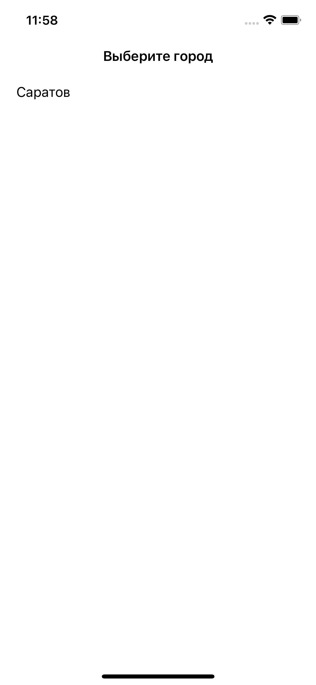
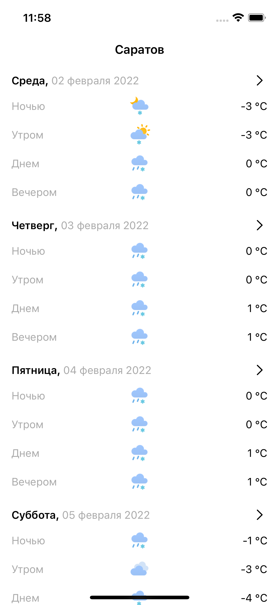
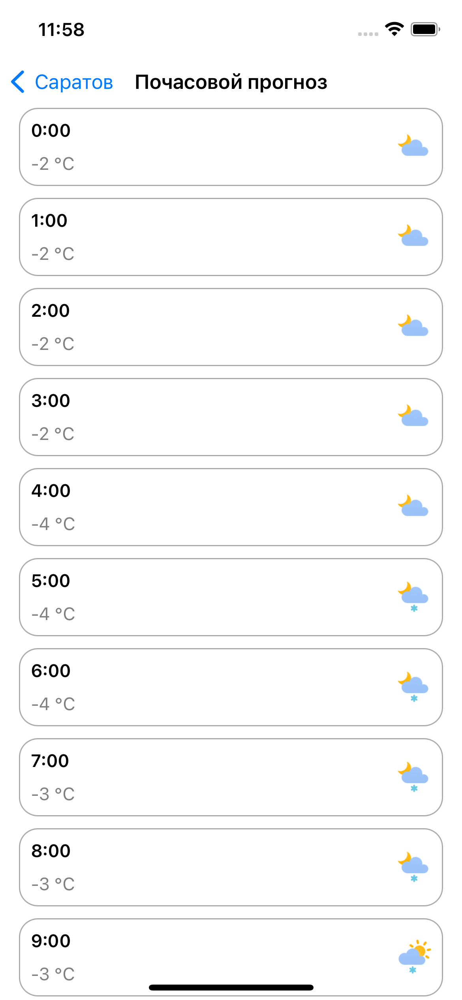

# Погода

Демо приложение, которые показывает погоду в выбранном городе на 7 дней.<br>
При выборе дня показывает почасовую погоду.

<p align="center">
  
  
  
</p>

<p>
Приложение имеет две сцены - сцена "Выбор города" и сцена "Прогноз погоды".
</p>
<p>
Сцена "Прогноз погоды" имеет два внутренних модуля - модуль "Погода в городе", модуль "Почасовой прогноз".
</p>
<p>
Для реализации использовались следующие технологии и внешние зависимости (Package Dependencies):

- VIPER - паттерн для работы с UI;
- Coordinator - навигация между сценами;
- Alamofire - запросы в сеть;
- Realm - хранение локальных данных;
- KingFisher - загрузка изображений;
- SVGKit - отображение .svg файлов;
- SnapKit - упрощение расположения UI элементов через код;
- R.swift - работа с текстами и пр.;
- SwiftLint - поддержка Code Style.
</p>

<p>
Минимальный iOS 13. Внешние зависимости устанавливаются через Swift Package Manager.
</p>

<p>

Для начала работы необходимо склонировать репозиторий на компьютер:
```bash
git clone https://github.com/era-wq/Weather
```
</p>

<p>

И запустить Weather.xcodeproj:
```bash
open Weather.xcodeproj
```
</p>

## Лицензия

MIT.
